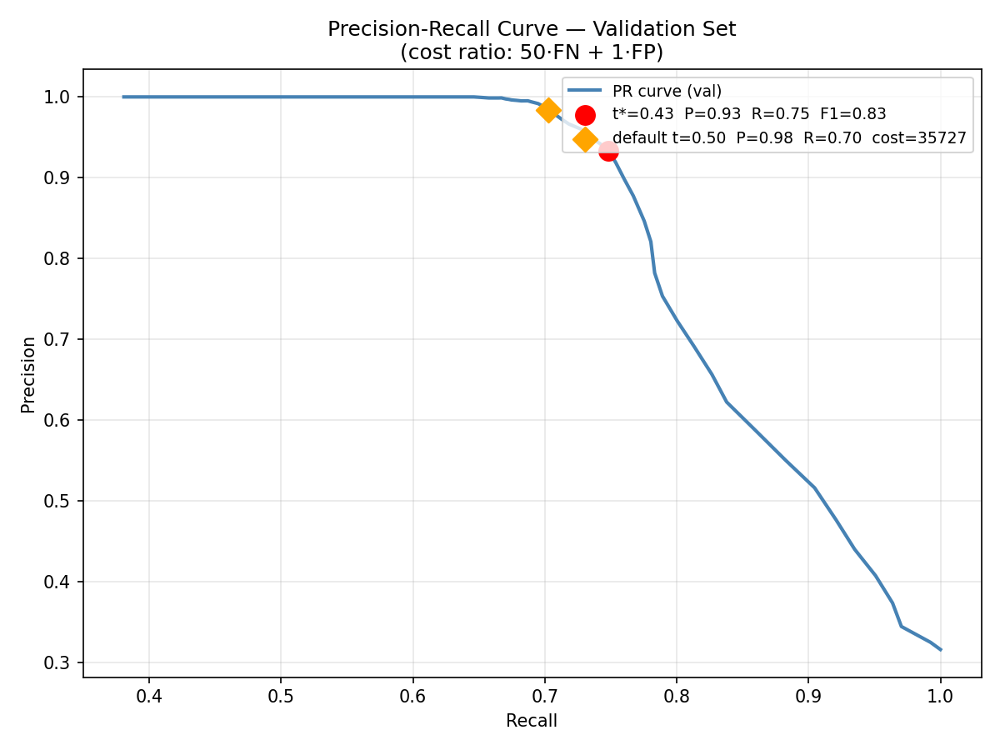

# Turbofan Predictive Maintenance

## Overview

I built a predictive maintenance system for turbofan engines using Transformers that detect anomalies and predict remaining useful life (RUL). The system uses SNR-scaled synthetic sensor data and maintenance logs, includes a Google Gemini-based explanation module for LLM-generated insights, and is served through a Flask API for prediction inference. I defined the system requirements and directed AI tools to scaffold and generate boilerplate code based on them, then I implemented, debugged, and integrated the components to complete training, evaluation, and deployment.

**Build mode.** System design, model architecture, data pipeline, evaluation methodology, by me. AI used to accelerate implementation where hand-writing boilerplate wouldn't have taught me anything new. All code reviewed and integrated by me.

## Why this project

Predictive maintenance on jet engines is one of the most consequential real-world ML applications. The difference between scheduled maintenance and unplanned failure is measured in dollars and sometimes in lives. I wanted to understand the full pipeline end to end: synthetic data generation, sliding-window Transformer design, multi-task loss for joint anomaly and RUL prediction, deployment as an inference API, and an LLM layer for failure-mode interpretation. The internship work that inspired it was production scope. This is the educational version I could share publicly.

## Getting Started

### Requirements

- Python 3.12
- A Google Gemini API key (for the LLM explanation layer)

### Setup

```bash
# Clone the repo
git clone https://github.com/williamcs50/turbofan-predictive-maintenance.git
cd turbofan-predictive-maintenance

# Create and activate a virtual environment
python3 -m venv venv
source venv/bin/activate

# Install dependencies
pip install -r requirements.txt
```

### Configuration

Create a `.env` file in the project root with your Gemini API key:

```
GEMINI_API_KEY=your-api-key-here
```

### Running the Pipeline

The pipeline runs in stages: generate synthetic data, preprocess, train, evaluate, serve.

```bash
# 1. Generate synthetic sensor data (v2, 5-channel, SNR-scaled)
python src/data_generation/generate_sensors_v2.py
python src/data_generation/generate_logs.py

# 2. Preprocess into model-ready windows
python src/preprocessing/preprocess.py

# 2a. Verify learnability (gate reads preprocessed data; all modes must clear 0.76 before training)
python scripts/run_gate.py

# 3. Train the Transformer model
python src/modeling/train_transformer.py
# If models/transformer_model.pth already exists, training is skipped and the saved model is loaded.
# Delete that file to retrain from scratch.

# 4. Evaluate on the held-out test set
python src/modeling/evaluate.py

# 5. Run threshold sweep (required before generate_plots.py — produces sweep_results.json for the PR curve)
PYTHONPATH=src python src/modeling/threshold_sweep.py

# 5a. Generate plots (saves PNGs to assets/)
PYTHONPATH=src python src/visualization/generate_plots.py

# 6. Start the Flask inference API
PYTHONPATH=src python src/inference/app.py

# 7. Run a sample inference with LLM enhancement
PYTHONPATH=src python src/inference/integrate_llm.py
```

## Architecture

1. The Data

Synthetic sensor time-series and maintenance logs are generated by `src/data_generation/generate_sensors_v2.py` and `src/data_generation/generate_logs.py`, then preprocessed by `src/preprocessing/preprocess.py`.

The dataset covers 50 engines with 1000 cycles each across 5 sensor channels: vibration, T50, P30, Nf, and fuel_flow. Five failure modes are simulated with SNR-scaled degradation ramps injected over the last 30% of each engine's life (TARGET_SNR_EOL=4.0). Maintenance logs are generated as unstructured JSON records linked to engine and cycle.

An engine-level train/test split is used to prevent leakage. Sensors are scaled with `MinMaxScaler` fit only on training data, and RUL is clipped at 125 cycles.

Synthetic data was chosen to give full control over failure modes, labels, and anomaly timing while ensuring reproducibility and removing any dependency on proprietary datasets.

2. The Model

The Transformer model in `src/modeling/train_transformer.py` operates on sliding windows of 50 timesteps with 5 sensor features per timestep. Each window is linearly embedded into a 128-dimensional hidden representation and combined with sinusoidal positional encoding.

The sequence is processed by a 3-layer Transformer encoder with 4 attention heads per layer. The output is aggregated using global average pooling to produce a fixed-length representation.

The model branches into two output tasks: a binary classification head for anomaly detection and a regression head for RUL prediction.

The anomaly head is trained with focal loss (gamma=2) to handle class imbalance by down-weighting easy negatives. The RUL head is trained using mean squared error (MSE) scaled by a factor of 0.1 in the joint objective.

3. The LLM Layer

The system includes a Google Gemini-based module for refining and interpreting model outputs. It takes the model's anomaly probability, predicted RUL, and up to five maintenance log descriptions for the same engine.

These inputs are combined into a structured prompt that asks the model to infer a likely failure mode and produce an adjusted RUL estimate in JSON format. JSON output is enforced using `response_mime_type: "application/json"` in the API configuration, ensuring structured responses.

The LLM operates as a post-processing step and does not affect the model's outputs. It is used to translate model predictions into a more interpretable, human-readable format for analysis.

4. The Evaluation

Evaluation is performed on a held-out test set to prevent data leakage across engine trajectories.

Each engine represents a full time-series trajectory, and splitting is done at the engine level to ensure no overlap between training and test sequences.

The Transformer produces two outputs per window: an anomaly classification and an RUL estimate.

Anomaly detection is evaluated using precision, recall, and asymmetric cost (50·FN + FP) at the cost-optimal threshold t\*=0.22, selected by sweeping the validation set under cost ratio r=50 (a missed failure costs ~50× a false alarm in this domain). RUL performance is evaluated using root mean squared error (RMSE) between predicted and true values across all test windows, reported in cycles.

## Results

[**Live dashboard**](https://williamcs50.github.io/turbofan-predictive-maintenance/)

### Test Set Metrics

| Metric | v0.2.0 (t=0.50) | v0.2.1 (t\*=0.22) |
|---|---|---|
| Anomaly Precision | 0.9591 | 0.3339 |
| Anomaly Recall | 0.8047 | 0.9957 |
| FN (missed failures) | 586 | 13 |
| Total Cost (50·FN + FP) | 29,403 | 6,608 (−78%) |
| RUL RMSE | 8.92 cycles | 8.92 cycles |

In v0.1, both prediction heads collapsed: the anomaly head predicted all-normal (precision/recall 0.00) and the RUL head output a near-constant mean (RMSE 41.72 cycles). v0.2.0 addresses both by replacing the synthetic data generator with an SNR-scaled design that puts degradation above the sensor noise floor for all five failure modes, replacing weighted cross-entropy with focal loss (gamma=2), and raising the RUL joint loss weight from 0.001 to 0.1.

v0.2.1 corrects the operating point. v0.2.0 defaulted to argmax (t=0.50), which optimizes balanced accuracy — the wrong objective for this domain. A threshold sweep on the validation set under cost ratio r=50 identified t\*=0.22 as the cost-minimizing operating point. At t\*=0.22, missed failures drop from 586 to 13 and total cost falls 78%, at the expected trade-off of lower precision (0.96 → 0.33). The RUL head is untouched.

### Anomaly Detection

Precision-recall curve on the validation set. Red dot: t\*=0.22, the cost-minimizing operating point under r=50. Orange diamond: default t=0.50 for comparison.


Confusion matrix at t\*=0.22. 2987 true positives, 13 false negatives (0.4% miss rate), 5958 false positives. The high FP count is the explicit cost of near-zero misses under r=50.

### RUL Prediction

Predicted vs. true Remaining Useful Life across the test set. Points track the diagonal; RMSE 8.92 cycles. Error near RUL=0 is small. The vertical band at true RUL=125 is a clipping artifact.
