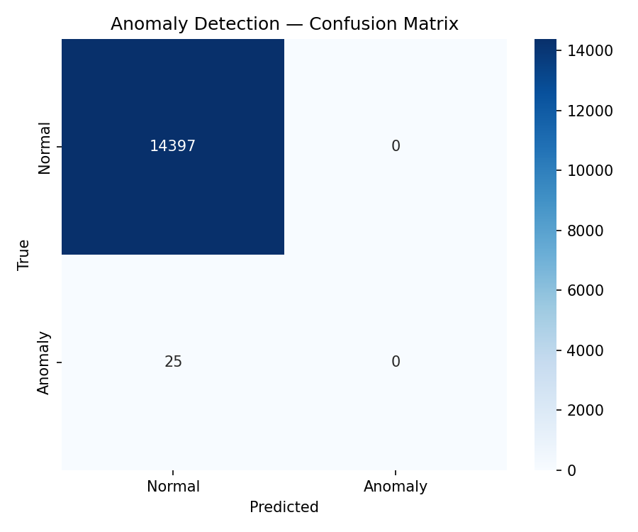
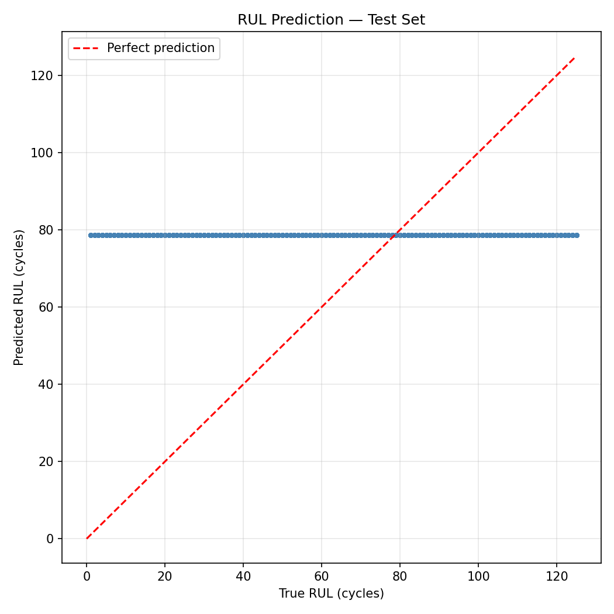

# Turbofan Predictive Maintenance

## Overview

I built a predictive maintenance system for turbofan engines using Transformers that detect anomalies and predict remaining useful life (RUL). The system uses physics-based synthetic sensor data and maintenance logs, includes a Google Gemini-based explanation module for LLM-generated insights, and is served through a Flask API for prediction inference. I defined the system requirements and directed AI tools to scaffold and generate boilerplate code based on them, then I implemented, debugged, and integrated the components to complete training, evaluation, and deployment.

**Build mode.** System design, model architecture, data pipeline, evaluation methodology, by me. AI used to accelerate implementation where hand-writing boilerplate wouldn't have taught me anything new. All code reviewed and integrated by me.

## Why this project

Predictive maintenance on jet engines is one of the most consequential real-world ML applications. The difference between scheduled maintenance and unplanned failure is measured in dollars and sometimes in lives. I wanted to understand the full pipeline end to end: synthetic data generation, sliding-window Transformer design, multi-task loss for joint anomaly and RUL prediction, deployment as an inference API, and an LLM layer for failure-mode interpretation. The internship work that inspired it was production scope. This is the educational version I could share publicly.

## Getting Started

### Requirements

- Python 3.12
- A Google Gemini API key (for the LLM explanation layer)

### Setup

```bash
# Clone the repo
git clone https://github.com/williamcs50/turbofan-predictive-maintenance.git
cd turbofan-predictive-maintenance

# Create and activate a virtual environment
python3 -m venv venv
source venv/bin/activate

# Install dependencies
pip install -r requirements.txt
```

### Configuration

Create a `.env` file in the project root with your Gemini API key:

```
GEMINI_API_KEY=your-api-key-here
```

### Running the Pipeline

The pipeline runs in stages: generate synthetic data, preprocess, train, evaluate, serve.

```bash
# 1. Generate synthetic sensor data and maintenance logs
python src/data_generation/generate_sensors.py
python src/data_generation/generate_logs.py

# 2. Preprocess into model-ready windows
python src/preprocessing/preprocess.py

# 3. Train the Transformer model
python src/modeling/train_transformer.py

# 4. Evaluate on the held-out test set
python src/modeling/evaluate.py

# 5. Generate plots (saves PNGs to assets/)
PYTHONPATH=src python src/visualization/generate_plots.py

# 6. Start the Flask inference API
PYTHONPATH=src python src/inference/app.py

# 7. Run a sample inference with LLM enhancement
PYTHONPATH=src python src/inference/integrate_llm.py
```

## Architecture

1. The Data

Synthetic sensor time-series and maintenance logs are generated by `src/data_generation/generate_sensors.py` and `src/data_generation/generate_logs.py`, then preprocessed by `src/preprocessing/preprocess.py`.

Each engine generates 100-300 cycles with 14 sensor channels (settings, temperatures, pressures, speeds, and vibration). Five failure-modes are simulated with parameterized degradation curves and explicit pre-anomaly windows. Maintenance logs are generated as unstructured JSON records linked to engine and cycles.

An engine-level train/test split is used to prevent leakage. Sensors are scaled with `MinMaxScaler` fit only on training data, and RUL is clipped at 125 cycles.

Synthetic data was chosen to give full control over failure modes, labels, and anomaly timing while ensuring reproducibility and removing any dependency on proprietary datasets.

2. The Model

The Transformer model in `src/modeling/train_transformer.py` operates on sliding windows of 50 timesteps with 14 sensor features per timestep. Each window is linearly embedded into a 128-dimensional hidden representation and combined with sinusoidal positional encoding.

The sequence is processed by a 3-layer Transformer encoder with 4 attention heads per layer. The output is aggregated using global average pooling to produce a fixed-length representation.

The model branches into two output tasks: a binary classification head for anomaly detection and a regression head for RUL prediction.

The anomaly head is trained with weighted cross-entropy loss to handle class imbalance. The RUL head is trained using mean squared error (MSE) scaled by a factor of 0.001 to strongly downweight its contribution in the joint objective.

3. The LLM Layer

The system includes a Google Gemini based module for refining and interpreting model outputs. It takes the model's anomaly probability, predicted RUL, and up to five maintenance log descriptions for the same engine.

These inputs are combined into a structured prompt that asks the model to infer a likely failure mode and produce an adjusted RUL estimate in JSON format. JSON output is enforced using `response_mime_type: "application/json"` in the API configuration, ensuring structured responses.

The LLM operates as a post-processing step and does not affect the model's outputs. It is used to translate model predictions into a more interpretable, human-readable format for analysis.

4. The Evaluation

Evaluation is performed on a held-out test set to prevent data leakage across engine trajectories.

Each engine represents a full time-series trajectory, and splitting is done at the engine level to ensure no overlap between training and test sequences.

The Transformer produces two outputs per window: an anomaly classification and an RUL estimate.

Anomaly detection is evaluated using accuracy, precision, and recall computed from predicted labels via `argmax` over logits. RUL performance is evaluated using root mean squared error (RMSE) between predicted and true values across all test windows, reported in cycles.

## Results

[**Live dashboard**](https://williamcs50.github.io/turbofan-predictive-maintenance/)

### Test Set Metrics

| Metric | Value |
|---|---|
| Anomaly Accuracy | 0.9983 |
| Precision | 0.0000 |
| Recall | 0.0000 |
| RUL RMSE | 41.72 cycles |

Accuracy is high due to class imbalance — the model predicts all-normal across the test set. Precision and recall are the meaningful signal. Focal loss is the planned fix.

### Anomaly Detection


### RUL Prediction

Predicted vs. true Remaining Useful Life across the test set. Diagonal shows perfect prediction.
